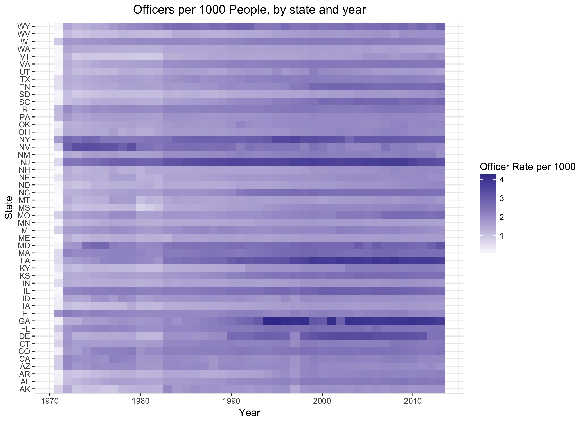
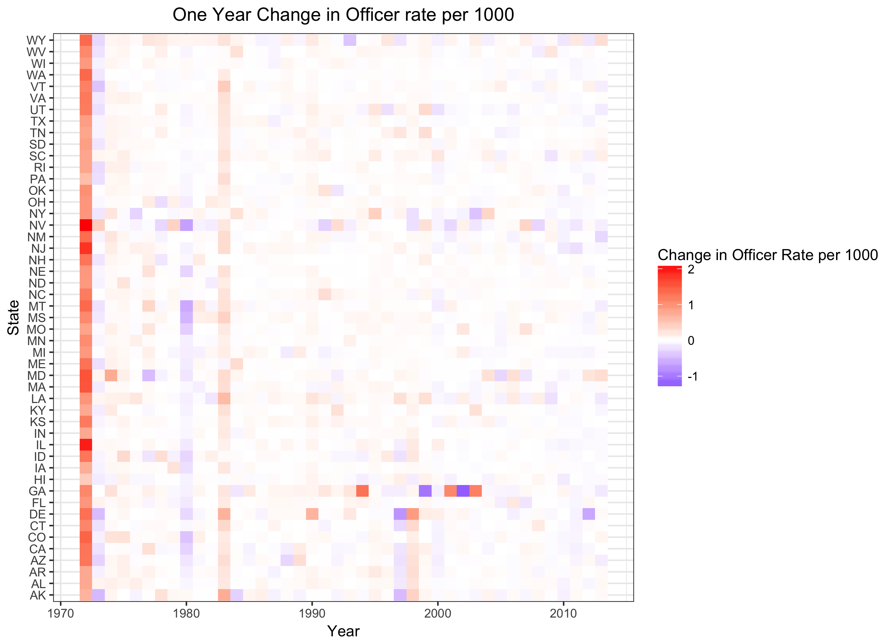
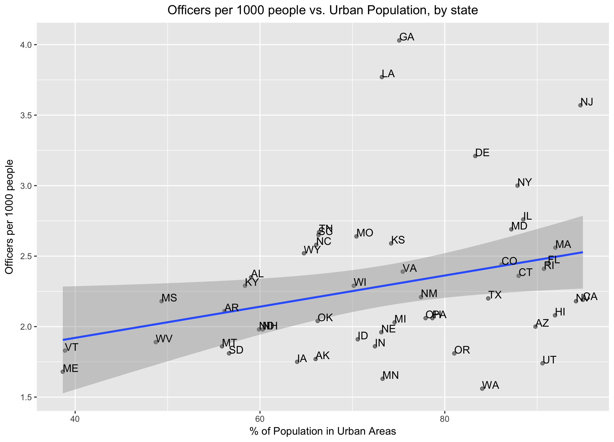

Title: Exploring Police Employee Data
Date: 2017-09-24
Category: blog
Tags: visualization, R, ggplot
Slug: 18f-fbi-police-employee-data
Author: Nick Jones
Summary: Using data provided by the FBI and 18F to see how police forces have grown

## Intro to data

18F and the FBI recently released a new website, the [Crime Data Explorer](https://crime-data-explorer.fr.cloud.gov/), that provides one central location
for a number of FBI reports and data. In addition to exposing an API to use UCR (Uniform Crime Reporting)
data, there are a number of datasets available for easy download. They also wrote a
[blog post](https://18f.gsa.gov/2017/09/07/opening-the-nations-crime-data/) announcing the new
website.

I've been reading Michelle Alexander's [The New Jim Crow](http://newjimcrow.com/), which explores
the many injustices of the criminal justice system, with a focus on The War on Drugs. It's an incredibly
eye-opening read, and quotes some crazy statistics about how the criminal justice system has evolved
over time.

To take advantage of some of the new data made accessible by 18F, and to contextualize my
reading of The New Jim Crow, I explored some of how police forces have changed over time. There's
nothing particularly groundbreaking about any of the analysis / plots below, but shows the power of
having important data like this accessible for people to analyze.

## Police Employee Data
I chose to look at one of the simpler datasets; the Police Employee Data, available on the
Crime Data Explorer [here](https://crime-data-explorer.fr.cloud.gov/downloads-and-docs).

Note that "The Uniform Crime Reporting (UCR) Program defines law enforcement officers as individuals
who ordinarily carry a firearm and a badge, have full arrest powers, and are paid from governmental
funds set aside specifically for sworn law enforcement representatives."

So, let's see how various states' police forces have changed over time. The dataset remarkably goes
back until 1970; Nixon first used the phrase "War on Drugs" [in June of 1971](http://www.npr.org/templates/story/story.php?storyId=9252490),
and it should come as no surprise that this "war" led to increased numbers in officers. We can see
that breakdown by state; I've used a heatmap below, since it allows us to see 3 dimensions easily
(state, year, and number of officers per 1000 people). A simpler line plot could be used as well,
but would be harder to read (since there would be a different line for each state).

### Quick note on the data
I removed both DC and Oregon from the below graphic. Comparing DC to states, which all have some
combination of urban areas and non-urban areas, is a bit misleading. DC is completely urban, and
therefore has a different makeup than states do. More on that later.

Oregon appeared to have incorrect data. Specifically, the data show that Oregon had 7031 (1.81 per
1000 people) officers in 2010, 23,006 (5.85 per 1000 people) officers in 2011, and returned back
to 6492 officers (1.75 per 1000 people) in 2012. The data from 2011 are likely just incorrect.



As we would expect, the number of police officers (per 1000 people) has increased pretty significantly
over time. A few things stuck out to me:

1. New Jersey (NJ) has always been very policed. I'd assume this is because it's a small state, but
is largely urban. Other larger states, such as California, may have similar rates of policing in their
urban areas, but the state-wide rate is diluted by having a large rural population as well. We'll
come back to this later.

2. What happened to Georgia in the 90s? There's specifically a big increase from 1993 to 1994; I did
a little bit of googling around, but couldn't find any significant legislation that might explain
those increases. The 1996 Olympics were in Atlanta, and the bid was won in 1990 (according to
[Wikipedia](https://en.wikipedia.org/wiki/1996_Summer_Olympics)), but it seems like a bit of a
stretch to claim that's the cause without any further evidence.

3. What led to the initial jump from 1971 to 1972? And what happened in the 80s? 1982 to 1983 specifically?
To identify specific years that change happened, it's useful to instead look at a plot of changes
over police rates over time. That is, a plot showing the increase (or decrease) in number of police
per 1000 people from one year to the next. Let's take a look at that.




The heatmap of deltas makes this a bit more clear. There was an increase across the board from 1971
to 1972, as well as from 1982 to 1983. These increases line up well with landmarks in the War on Drugs:

#### "Public enemy number one" - Nixon, 1971
President Richard Nixon gave a speech on June 17, 1971, declaring that drug abuse was "public enemey
number one." The full text of this speech can be found [here](http://www.presidency.ucsb.edu/ws/?pid=3047).
As shown above, there was an increase across all states in the following year (comparing 1972 to 1971).

#### "Federal Initiatives Against Drug Trafficking" - Reagan, 1982
President Reagan announced a number of initiatives on October 14, 1982 in a speech at the Justice
Department. See the [full speech](http://www.presidency.ucsb.edu/ws/?pid=43127), and some more
[context on that speech](http://www.politico.com/story/2010/10/reagan-declares-war-on-drugs-october-14-1982-043552). This speech makes eight explicit points, including:

> "First, in view of the success of the South Florida Task Force, and because of increasing organized crime involvement in drug abuse, we will establish 12 additional task forces in key areas in the United States."

> "And eighth, millions of dollars will be allocated for prison and jail facilities so that the mistake of releasing dangerous criminals because of overcrowded prisons will not be repeated."

Since this speech was given towards the end of 1982, we see the increase across all states in the
following year (comparing 1983 to 1982).

## More urban states have more police
I mentioned New Jersey having a lot of police, and excluding DC above because it's completely urban (whereas the states have parts that are urban, parts that are not). So let's see if there is indeed a relationship between
how urban a state is, and how policed it is.

The Census website has data about "how urban" states are - this can be defined in a few ways, but the one
we're interested in is "Percentage of the total population of the state represented by the urban population
." I used data from 2010, which
can be found [here](https://www.census.gov/geo/reference/ua/ualists_layout.html), under "2010 Percent
Urban and Rural by State", the PctUrbanRural_State.txt data specifically.

Taking a quick look at this data combined with our original dataset of number of officers per 1000 people, there
does seem to be a relationship - the more urban a state is, the greater number of police officers. The plot below
could use some work (the state labels are messy), but shows the general trend.



There are certainly many other factors at play here, but even a simple linear model shows that how
urban a state is can significantly predict how policed it is. See below for full details of that
model.

## Conclusion
This post only looks at a tiny portion of the data available through the UCR and the Crime Data
Explorer. I'm hoping to spend more time looking at some of the richer datasets as well; it's great
to see a push for making these kinds of datasets more easily accessible. Thanks for reading!


### Code / data
All of the code used in this post is available [on Github](https://github.com/nrjones8/18f-crime-data) -
it includes pulling in a few different datasets, calculating the year-over-year changes in officer
rates, and creating plots.

The model used to predict officer rates, based on how urban a state is:
```
lm(formula = officer_rate_per_1000 ~ POPPCT_URBAN, data = year_2010)

Residuals:
    Min      1Q  Median      3Q     Max
-0.8473 -0.3186 -0.1075  0.2407  1.7220

Coefficients:
             Estimate Std. Error t value Pr(>|t|)
(Intercept)  1.478276   0.373703   3.956 0.000251 ***
POPPCT_URBAN 0.011053   0.004984   2.218 0.031337 *
```