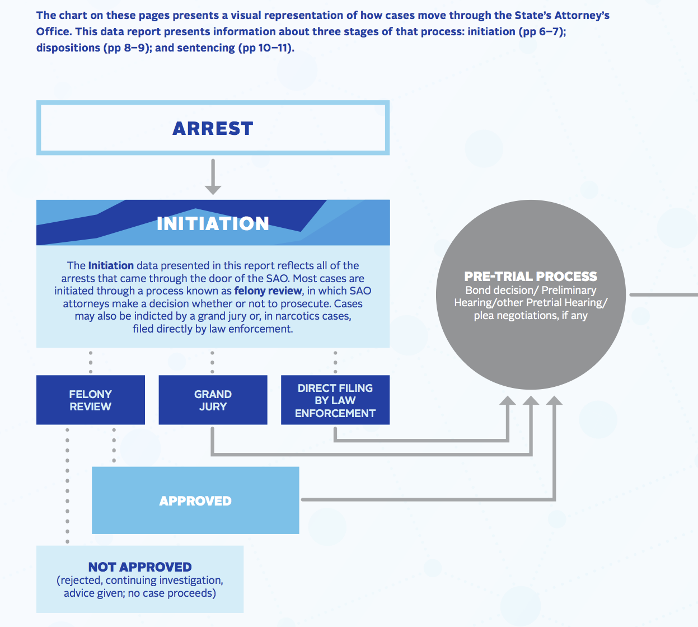

Title: Cook County SAO Dispositions - Direct Filing and Narcotics Cases
Date: 2017-11-29
Category: blog
Tags: R, ggplot
Slug: cook-county-sao-dispositions
Author: Nick Jones
Summary: Exploring disposition data provided by Cook County's state attorney's office

> We have extensive data on crimes, arrests, and prison populations, but when it comes to prosecutors we have next to nothing...We have no comprehensive data on such basic issues as the number of cases resolved by plea bargaining, the number of cases dismissed by prosecutors or judges, or the demographics of line prosecutors—and how those might interact with the demographics of defendants or defense counsel.

> &mdash; John Pfaff, author of Locked In: The True Causes of Mass Incarceration, Kindle Locations 2582-2587

As John Pfaff notes in his [recent book _Locked In_](https://www.goodreads.com/book/show/29502356-locked-in), it's hard to come across data on prosecutors. When Cook County State's Attorney Kim Foxx released a dataset and report on how the State's Attorney's Office (SAO) had handled felony cases over the past six years, I was excited to take a look at some of the data. The [report itself](https://www.cookcountystatesattorney.org/sites/default/files/files/documents/ccsao-data-report-oct-2017.pdf) looks just at data from 2016, while there are a number of datasets released for data starting in 2011.

The report is pretty detailed, and provides a lot of helpful context on what the data mean and don't mean. It also provides some great visual explanations of how a case moves through the SAO - from arrest to initiation to pre-trail to a disposition to sentencing. I was particularly curious about dispositions, but noticed that the "Disposition" section excluded an analysis / breakdown of narcotics cases. This post looks into how narcotics cases are treated differently, and why the report may have left those cases out of their disposition analysis.

All data used below came from the [State's Attorney Felony Cases - Disposition Outcomes By Offense Type and Defendant Race](https://datacatalog.cookcountyil.gov/Courts/State-s-Attorney-Felony-Cases-Disposition-Outcomes/cqdb-r84f) dataset, and the code used to calculate numbers and generate graphics can be found [here](https://github.com/nrjones8/cook-county-states-attorney/blob/master/analysis.R). For a more detailed explanation of the code, please see [a second post I wrote on the topic](http://nrjones8.me/dplyr-intro-sao-data.html).

## How Narcotics Cases are Initiated
The report notes that narcotics cases are initiated differently from all other cases. Non-narcotics cases go through either (1) Felony review (where attorneys at the SAO decide whether or not to prosecute) or (2) a grand jury. There's a brief explanation (and helpful flowchart) of these differences on page 4 of the report, part of which is reproduced below.

Narcotics cases, however, are filed directly by law enforcement - they do not go through felony review or a grand jury. On page 6, the "Initiations" section explains:

> Law enforcement may directly file charges in narcotics cases without FRU approval. The first time the SAO has any involvement in those cases is at preliminary hearing. In the data these are referred to as "bond set" cases.

As a result, comparing the dispositions of narcotics cases (vs. other types of cases, such as retail theft, DUIs, etc.) would not be a fair comparison.

For example, looking at all dispositions in the provided data (2011 - 2016), cases labeled as "Narcotics” led to a guilty plea just 43% of the time, compared to 75% of the time for all other types of cases. That is quite different from what I'd expect to see, since plea bargains are generally quoted to happen in the vast majority of cases. See, e.g. [this report from the Human Rights Watch](https://www.hrw.org/report/2013/12/05/offer-you-cant-refuse/how-us-federal-prosecutors-force-drug-defendants-plead) - it focuses on federal drug cases, but the general trend of pleas holds at the state level as well.

That suggests that we need to take a closer look at the data - there are likely more narcotics cases making to the "disposition” stage than other types of cases. I suspect this is why narcotics cases were left out of the "Disposition” section starting on page 8.
## Narcotics Dispositions
Looking at all narcotics data (years 2011 - 2016), the data start to make sense. The table below shows the most common narcotics dispositions, along with the most common dispositions for _non_-narcotics cases.

<table border=1 frame=void rules=rows>
    <thead>
        <tr>
        <th>Disposition</th>
        <th align="center">Number of narcotics cases</th>
        <th align="center">% of all narcotics cases</th>
        <th align="center">Number of non-narcotics cases</th>
        <th align="center">% of all non-narcotics cases</th>
        </tr>
    </thead>
    <tbody>
    <tr>
        <td>Plea Of Guilty</td>
        <td align="center">43,782</td>
        <td align="center">43%</td>
        <td align="center">95,049</td>
        <td align="center">75%</td>
    </tr>
    <tr>
        <td>FNPC</td>
        <td align="center">26,911</td>
        <td align="center">26%</td>
        <td align="center">3,363</td>
        <td align="center">3%</td>
    </tr>
    <tr>
        <td>Nolle prosequi</td>
        <td align="center">26,365</td>
        <td align="center">26%</td>
        <td align="center">12,565</td>
        <td align="center">10%</td>
    </tr>
    <tr>
        <td>Finding guilty</td>
        <td align="center">2,045</td>
        <td align="center">2%</td>
        <td align="center">6,567</td>
        <td align="center">5%</td>
    </tr>
    <tr>
        <td>Finding not guilty</td>
        <td align="center">1,735</td>
        <td align="center">2%</td>
        <td align="center">4,646</td>
        <td align="center">4%</td>
    </tr>
    </tbody>
</table>

 

As we would expect, "Plea of Guilty” is most common. But the more interesting classifications are the next two most common - FNPC ("Finding of no probable cause”) and Nolle prosequi (the SAO chose not to proceed). This seems to explain why we thought that narcotics cases had such a lower rate of guilty pleas. A narcotics charge does not get initiated through felony review or a grand jury, resulting in a significant number of cases being initiated that end up being dismissed (either by a finding of no probable cause, or the prosecution simply choosing not to proceed). In non-narcotics cases, more of these cases wouldn't even reach initiation - they wouldn't make it past a grand jury or felony review by the SAO.

If we remove the "FNPC" and "Nolle prosequi" cases, we end up seeing pretty similar plea rates in narcotics vs. non-narcotics cases. In 2016, 85% of narcotics cases ended in a guilty plea, while 82% of non-narcotics cases ended in a guilty plea.

## Why don't narcotics cases go through felony review or a grand jury?
I researched this a bit - there is a [2012 research report on "Policies and Procedures of the Illinois Criminal Justice System](http://www.icjia.state.il.us/assets/pdf/ResearchReports/Policies_and_Procedures_of_the_Illinois_Criminal_Justice_System_Aug2012.pdf) but that lacked any reference to direct filings. Cook County's ["Guide to the Criminal Justice System"](https://www.cookcountyil.gov/service/guide-criminal-justice-system) also doesn't mention direct filings.

What I could find simply suggested that direct filing by law enforcement was a choice that a state attorney's office could make. I found a reference from 2010 in the _CHRI User's Manual_ (full manual available [here](http://www.isp.state.il.us/docs/5-336e.pdf)), which reads:

> State's attorney's offices may allow local agencies to direct file criminal charges with the circuit court clerk. The state's attorney must submit a letter describing the circumstances where local agencies may direct file criminal charges. State's attorneys do not need to submit paper copies of filing decisions for charges that have been determined to be direct filed, however paper submissions are required for other filing decisions. These filing decisions will automatically appear on the subject's criminal history record.

The Illinois Criminal Justice Information Authority also does audits of "the Criminal History Record Information (CHRI) system to assess the accuracy, timeliness, and completeness of criminal history records, while ensuring compliance with federal guidelines." The 2003 version of this audit (report available [here](http://www.icjia.state.il.us/assets/pdf/bulletins/chriVol2Num7.pdf)) also made reference to direct filing:

> The state's attorney is required to report disposition information indicating if the charges were filed, not filed, and/or if any charge information was added, dismissed, or modified subsequent to the filing of a case. Direct filing is an intentional and systematic exclusion of the state's attorney's office (with prior written approval from the state's attorney's office) in the CHRI form routing process that occurs when arresting agencies file charges directly with the circuit court clerks.

One hypothesis is that the FNPC and Nolle prosequi outcomes are essentially the same as an attorney at the SAO rejecting a case at the "Felony review" state. But does that mean that all people charged in narcotics cases have to post bail? Even if those cases go on to be dismissed? As quoted above, the report mentions:

> The first time the SAO has any involvement in those cases is at preliminary hearing.

According to the report and to HG.org's [article on the Illinois Felony Process](https://www.hg.org/article.asp?id=5008), the preliminary hearing happens after a bond hearing. If that's the case, then "direct filing" by law enforcement seems like it would be significantly worse for defendants, who may end up sitting in jail waiting for a case that will eventually be dismissed. If such cases instead went through the Felony Review process, then presumably fewer cases would be initiated - more importantly, those defendants wouldn't have gone through a bond hearing or preliminary hearing.

If anyone has a better understanding of the "direct filing by law enforcement" process for narcotics cases, or if I'm misinterpreting what the impact of such cases is, please [reach out via Twitter or email](http://nrjones8.me/about.html). Thanks for reading!
