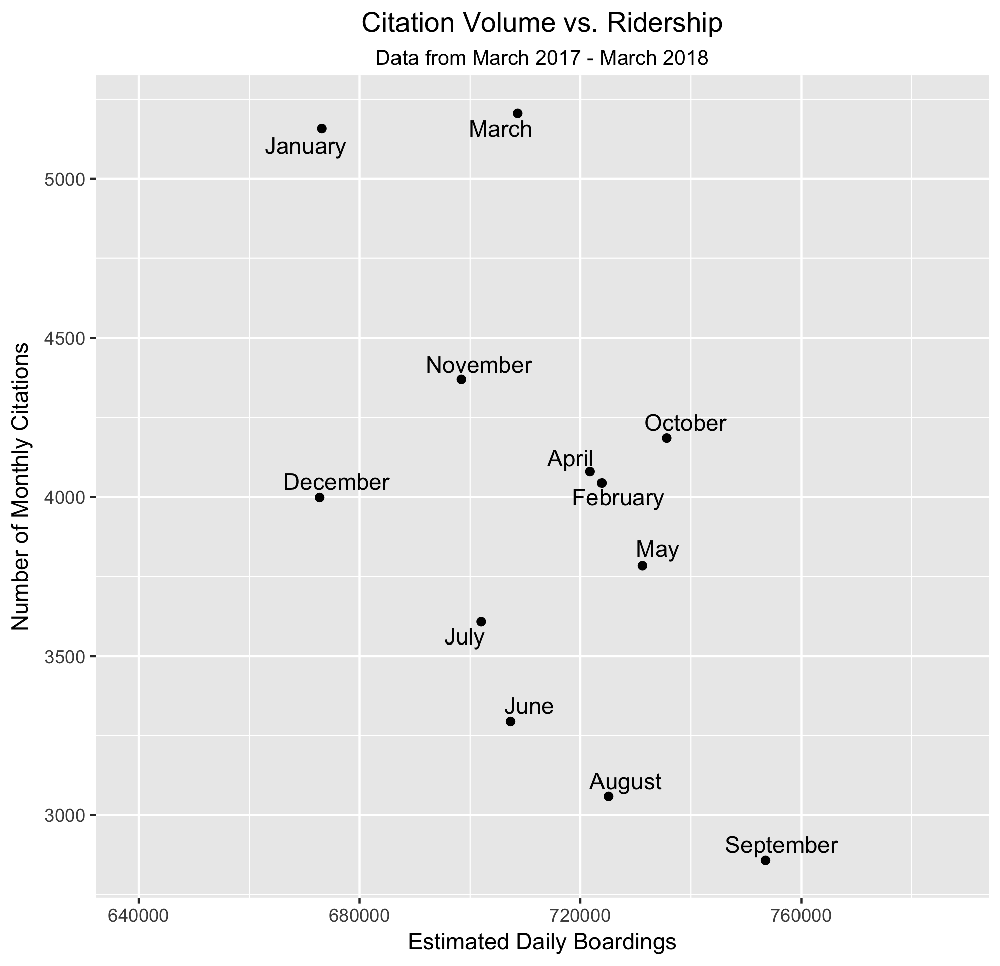

Title: Rainy day on MUNI? Make Sure You've Paid Your Fare
Date: 2018-05-20
Category: blog
Tags: R, ggplot, visualization, transit
Slug: more-muni-citations-on-rainy-days
Author: Nick Jones
Summary: Anyone who rides MUNI regularly has seen fare inspectors checking Clipper cards, and writing citations. What influences the number of citations written on any given day - does weather have any impact? The answer is yes, but the details are more complicated.

Anybody who rides MUNI regularly has had their Clipper Card checked by a fare inspector - anecdotally, it also seemed to me that my Clipper Card was being checked more often when it rained. Using data obtained from the SFMTA, it appears that rainy days do in fact result in more citations - but determining _why_ that's the case is a more complicated question.

Based on citations issued from March 2017 to March 2018, SFMTA issued an **average of 156 citations on days when it rained, vs. 127 citations on days when it did _not_ rain.** Ridership, and as a result, citations, varies a lot on weekends vs. weekdays. Looking just at weekdays, the pattern holds: an average of 171 citations were issued on rainy weekdays, vs. an average of 148 on weekdays when it did not rain. Of the 362 days analyzed, 53 days were rainy.

There are a number of other factors that may influence the number of citations given out on any given day - below, we'll see that none of them completely accounts for the increased rate on rainy days.

## What about the day of the week? Does it rain more on high-ridership days?
The day of week presumably also impacts how many citations fare inspectors hand out. People generally ride public transit less on weekends, so there are fewer people in total who could possibly be riding without having paid. It's also possible that it _happened_ to rain more on days when people were taking public transit more often - looking at the one year of data, the 53 days of rain were not distributed evenly across all days:


A simple linear model can account for the day of the week, estimating the number of citations handed out based on (1) the day of week and (2) whether it rained or not. When accounting for day of the week, the presence of rain was still associated with an increase of about 18 citations on a given day - see the end of this post for details of the regression model.


## Do people just ride MUNI more often on rainy days?
Another possible explanation for the greater number of citations on rainy days is that people simply take public transportation more when it rains - if more people take transit and a fixed percentage of them have not paid, then the number of citations would increase on rainy days. The SFMTA does not collect daily ridership numbers - I filed a public requests request for daily numbers, and was informed that they base their ridership data based on sampling.

Although there's no San Francisco specific data, existing research seems to suggest that rain actually _decreases_ ridership - a [study of bus ridership](http://scholarcommons.usf.edu/jpt/vol15/iss1/6/) in Pierce County, Washington notes "Rain negatively affected ridership in all four seasons," while a [study of the Chicago Transit system](http://www.transportchicago.org/uploads/5/7/2/0/5720074/ps3_transitinclementweather.pdf) found that "Generally, good weather tends to increase ridership, while bad weather tends to reduce it." As a result, it seems unlikely that the increase in citations on rainy days is due simply to an overall increase in ridership.

## What about seasonality?
Another possible explanation is seasonality - if it's more likely to rain during times of the year when people ride MUNI more, then it's possible that greater ridership leads to the increase in citations. Could seasonality be a confounding variable, causing more rain, a greater number of riders, and therefore more citations? That doesn't seem to be the case. Using [data on average weekday boardings by month](https://www.sfmta.com/reports/muni-average-weekday-boardings) from MUNI, we can compare the monthly number of citations with overall ridership. The _opposite_ actually appears to be true - the greater ridership in a given month, the fewer citations.



## Who gets citations on rainy days?
My original thinking behind this dataset was that people needed to seek shelter when there is bad weather, and often the easiest shelter is public transit. When more people who cannot afford MUNI board without buying a ticket, those same people would be the ones most likely to receive a citation. It's hard to know for sure, but the data that MUNI provided also don't seem to support this idea.

In addition to providing the time and location of citations, the dataset includes (1) the total amount of the fee that has been paid and (2) the total amount of the fee that is still due. Note that fees are not static; if someone doesn't pay the citation by its due date, [additional fees can be added](https://www.sfmta.com/getting-around/drive-park/citations), meaning a Fare Evasion fee of $125 can increase with every payment date that is missed.

While it's impossible to know the financial situations for each person cited, whether or not someone paid their citation fine is a possible proxy - if a person doesn't pay their fine, that person is more likely to not have the money to do so. If poorer residents are the ones who are ticketed more often on rainy days, then we would expect to see that rainy days have more unpaid citations. This doesn't seem to be the case, as roughly the same percentage of citations has been paid on rainy days (38%) as days when it did not rain (37%).

<table class="table table-striped">
    <thead>
        <tr>
            <th>Weather</th>
            <th># of days</th>
            <th>Citations issued</th>
            <th>Citations paid</th>
            <th>% of citations paid</th>
        </tr>
    </thead>
    <tbody>
        <tr>
            <td>No Rain</td>
            <td>309</td>
            <td>39,369</td>
            <td>14,703</td>
            <td>37%</td>
        </tr>
        <tr>
            <td>Rain</td>
            <td>53</td>
            <td>8,272</td>
            <td>3,166</td>
            <td>38%</td>
        </tr>
    </tbody>
</table>

## Further reading
The topic of fare inspectors has been covered a few times recently - the [SF Examiner](http://www.sfexaminer.com/exempt-anti-quota-law-muni-fare-inspectors-pressured-issue-tickets/) wrote about quotas and inspectors, while [Hoodline](https://hoodline.com/2017/03/when-it-comes-to-fare-enforcement-muni-s-inspectors-rarely-stray-far-from-hq?utm_source=story&utm_medium=web&utm_campaign=stories) wrote an interesting analysis of _where_ fare inspectors are most likely to hand out citations.

Based on the data and analysis above, it's not entirely clear why more citations occur on rainy days. Even though citations were paid at a similar rate on rainy days vs. non-rainy days, it would be interesting to explore in more detail the relationship between weather and who is being fined. If low-income communities are more impacted by fines on rainy days, the data here suggest that they are still able to pay those fines - perhaps with the help of The City of San Francisco's [Financial Justice Project](http://sftreasurer.org/financialjustice), which has been working on helping ensure that fines and fees are not overly harsh on low-income communities.

### Data from the SFMTA
Data on individual citations was obtained via public records request from the SFMTA. Each row in this dataset represents a single citation, and includes a number of fields - the ones used here were:

* The time of the violation
* The location of the violation
* The exact violation code - e.g. "7.2.101" refers to a general "Fare Evasion" citation, see [Fiscal Year 2018 fines](https://www.sfmta.com/sites/default/files/reports-and-documents/2017/11/fy_18_fines.pdf)
* The total amount due
* The total amount already paid

The dataset provided by the SFMTA included one year and one month (from March 2017 through March 2018, so 13 months) of citations - about 50,000 in total. The analysis done here only used exactly one year of that data, or roughly 47,000 citations.

The raw data provided by the SFMTA is [available here](https://github.com/nrjones8/sf-transit-violation-tickets/blob/master/data/raw/P000340_042418_Transit_Violation_Tickets_March_2017_through_March_2018.xlsx), and the CSV version [available here](https://github.com/nrjones8/sf-transit-violation-tickets/blob/master/data/P000340_042418_Transit_Violation_Tickets_March_2017_through_March_2018.csv).

### Data from the NOAA
To see the relationship between weather and citation data, historical weather data was downloaded from the NOAA. The NOAA makes daily summaries by location available for download; the raw data used in this analysis is available [on Github](https://github.com/nrjones8/sf-transit-violation-tickets/blob/master/data/raw/order_1327523_noaa_2017_01_01_to_2018_04_23.csv). I requested it from the [downtown San Francisco](https://www.ncdc.noaa.gov/cdo-web/datasets/GHCND/stations/GHCND:USW00023272/detail) station - click "Add to Cart," then select the date range and specific fields of interest. Despite being referred to as a "cart," it's free.

A day was classified as "rainy" if the `PRCP` field ("precipitation") indicated there was any precipitation that day. In the 362 days analyzed, 53 days had some rain and were therefore classified as "rainy" for the purposes of this analysis.

### Simple linear model
The output of a linear regression model is shown below; the number of tickets as a function of (1) whether it rained or not and (2) the day of the week. As mentioned above, a rainy day was associated with ~18 more tickets when compared to the number of citations issued on a day without rain.
```
               term estimate std.error statistic   p.value
1         (Intercept)   87.578     5.925   14.7820 < 0.0001
2     did_it_rainTRUE   18.562     6.345    2.9253 0.003
3 char_day_of_weekMon    3.555     8.295    0.4286 0.668
4 char_day_of_weekSat   -9.359     8.424   -1.1110 0.267
5 char_day_of_weekSun  -15.066     8.292   -1.8169 0.070
6 char_day_of_weekThu   97.476     8.306   11.7363 < 0.0001
7 char_day_of_weekTue  103.733     8.295   12.5059 < 0.0001
8 char_day_of_weekWed  104.683     8.265   12.6659 < 0.0001
```

